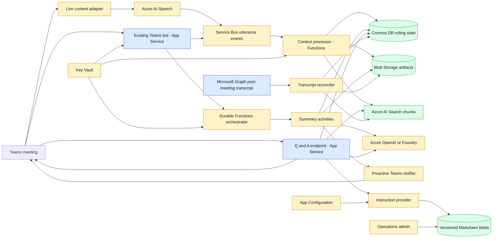

# Live Meeting Intelligence Architecture Plan

## Status

Discovery proposal. No implementation decisions in this document are final.

## Objectives

Evolve the existing Teams meeting bot to support:

1. A new rolling summary message at a configurable interval during an active
   meeting.
2. A condensed summary at a longer configurable interval.
3. Rolling meeting context for questions and answers while the meeting is active.
4. Operationally editable Markdown instruction files without redeploying the app.
5. Post-meeting reconciliation with the official Microsoft Graph transcript.

The current product decisions are:

- Questions must be answerable from words spoken during the active meeting.
- Each scheduled summary is posted as a new message in the meeting chat.
- Operations administrators must be able to edit instructions without an application deployment.
- Initial POC testing uses a 30-second rolling-summary interval and a 2-minute
  condensed-summary interval. These are accelerated test settings, not proposed
  production defaults.
- Service-level targets are intentionally deferred until the end-to-end path can
  be measured.

## Baseline

The current application:

- Runs as a .NET Teams bot in Azure App Service.
- Handles meeting start, end, and participant events.
- Enqueues transcript work only after a meeting ends.
- Polls Microsoft Graph for the official transcript.
- Normalizes and chunks WebVTT transcript content.
- Stores jobs and source documents as JSON under the App Service file system.
- Posts the completed transcript proactively to the meeting conversation.

The current Graph transcript flow remains useful as the authoritative
post-meeting source, but it cannot provide spoken context during an active
meeting. Live question answering therefore requires a separately validated
source of live meeting content.

## What the V1 POC proved

V1 proved the outer Teams and post-meeting transcript loop:

| Capability | V1 evidence | Status |
|---|---|---|
| Teams application hosting | The bot runs as an ASP.NET application and exposes the Teams endpoint | Proven |
| Meeting lifecycle events | Start, end, participant join, and participant leave handlers are registered | Proven |
| Meeting and organizer identity | The meeting-end handler resolves Graph meeting metadata | Proven |
| Post-meeting transcript retrieval | Microsoft Graph transcript listing and WebVTT retrieval are implemented | Proven |
| Delayed transcript retry | A hosted worker retries delayed Graph transcript publication | Proven for one application process |
| Duplicate meeting-end suppression | Jobs are keyed by tenant and meeting ID | Proven for the file-backed store |
| Transcript normalization | WebVTT is parsed into timestamped speaker segments | Proven |
| Agent-ready chunking | Transcript segments are grouped into stable source chunks | Proven |
| Chat-model integration | A deployed chat model can receive the completed meeting transcript as context and respond | Proven in the deployed V1 environment |
| Post-meeting transcript Q&A | Users can ask questions against the end-of-meeting transcript context | Proven in the deployed V1 environment |
| Durable POC artifacts | Jobs and source documents survive deployment when stored under App Service `/home` | Proven for the current App Service topology |
| Proactive Teams output | The application posts a transcript card to the original conversation | Proven |

V1 did **not** prove:

- Access to spoken words while the meeting is still active.
- Rolling context mutation.
- Rolling or condensed summaries.
- Question answering from context that changes while the meeting is active.
- Semantic or vector retrieval.
- Distributed scheduling and scale-out coordination.
- Blob-hosted, operationally editable Markdown instructions.
- Reconciliation between a live transcript and the official Graph transcript.
- Production security, retention, observability, cost, or quality thresholds.

V1 covers much of the outer integration path and proves the basic
transcript-to-model interaction. The remaining work changes the timing and
state model from one completed transcript to continuously changing meeting
context. This is a larger change than simply calling the existing model more
often.

For a visual comparison, open
[`live-meeting-intelligence-coverage.html`](live-meeting-intelligence-coverage.html).

## Target architecture



Blue nodes are existing or extended capabilities, yellow nodes are new
processing or infrastructure, and green nodes are durable data stores.

## Complexity scale

Estimates assume one senior .NET/Azure engineer and exclude tenant approval,
procurement, security review, and production rollout.

| Rating | Typical effort | Meaning |
|---|---:|---|
| S | 0.5-2 days | Configuration or a straightforward adapter |
| M | 3-5 days | A bounded component using established SDKs |
| L | 1-2 weeks | A stateful workflow or multi-service integration |
| XL | 3-8+ weeks | A specialized platform, compliance, or uncertain API |

## Complexity by architecture node

| Node | Purpose | Complexity | Estimate | Principal risk |
|---|---|---:|---:|---|
| Existing Teams bot | Start and end sessions and handle questions | M | 3-5 days | Meeting identity and conversation references |
| Live content adapter | Obtain live spoken meeting content | XL | 4-8+ weeks | API suitability, hosting, consent, and attribution |
| Azure AI Speech | Convert live audio into finalized utterances | L | 1-2 weeks | Latency, diarization, reconnects, and languages |
| Service Bus | Decouple producers and consumers | M | 2-4 days | Ordering, duplication, and poison messages |
| Context processor | Convert utterances into chunks and rolling state | L | 1-2 weeks | Concurrent updates and exactly-once effects |
| Cosmos DB | Store active meeting state and checkpoints | M | 3-5 days | Partitioning and optimistic concurrency |
| Blob Storage | Store raw, generated, and instruction artifacts | M | 2-4 days | Retention, versioning, and authorization |
| Azure AI Search | Retrieve transcript evidence | L | 1-2 weeks | Freshness, index design, and citation accuracy |
| Durable orchestrator | Schedule work for each meeting | L | 1-2 weeks | Replay-safe code and idempotent activities |
| Summary activities | Create interval and condensed summaries | L | 1-2 weeks | Summary drift and output validation |
| Azure OpenAI or Foundry | Generate summaries and grounded answers | M-L | 4-7 days | Model selection, quota, cost, and latency |
| Proactive Teams notifier | Post every scheduled summary | M | 2-4 days | Conversation resolution and retries |
| Q&A endpoint | Answer from hot and indexed meeting context | L | 1-2 weeks | Authorization, freshness, and grounding |
| Instruction provider | Load, validate, version, and cache Markdown | M | 3-5 days | Safe publication and cache invalidation |
| Admin workflow | Publish instruction versions | S or L | 1-2 days or 2-4 weeks | Storage Explorer versus a custom UI |
| Transcript reconciler | Merge the official post-meeting transcript | M-L | 4-7 days | Aligning live and official segments |
| App Configuration | Store published-version pointers and flags | S-M | 1-3 days | Coordinated refresh |
| Key Vault and identity | Remove secrets and establish RBAC | M | 2-4 days | Correct least-privilege assignments |
| Application Insights | Trace workflows and AI operations | M | 3-5 days | Correlation across service boundaries |

## Models to use for the next POC

Reuse the V1 chat-model deployment first. The only additional model deployment
needed for the planned retrieval path is an embedding model. Azure AI Speech is
a separate Azure AI service resource and is not a Foundry model deployment.

| Deployment | POC recommendation | Used for | Required now |
|---|---|---|---|
| Existing V1 chat model | Reuse the deployed model and its current authentication/configuration | Rolling summaries, condensed summaries, decision/action extraction, and grounded answers | Already provisioned |
| Embedding model | `text-embedding-3-small` | Vectorizing transcript chunks and questions for Azure AI Search | Yes when Q&A retrieval is introduced |
| Higher-quality embedding model | `text-embedding-3-large` | Optional retrieval-quality comparison | No; provision only if evaluation shows the small model is insufficient |
| Alternative chat/reasoning model | A current model available in the selected region | Quality comparison only if the existing V1 model misses requirements | No |

Use the existing V1 deployment for both summary and Q&A experiments initially.
A second chat deployment is warranted only if the current model lacks required
structured output or context capabilities, or if quota isolation, a different
model version, or independent scaling becomes necessary.

Model names and versions must be rechecked against regional availability and
quota when provisioning. The application should reference deployment names
through configuration rather than hard-code model names.

### POC model evaluation

The model spike should compare:

- Schema adherence for decisions, actions, risks, and open questions.
- Incremental-summary stability across repeated 30-second windows.
- Condensed-summary loss across each 2-minute rollup.
- Citation faithfulness for question answering.
- Latency, token consumption, throttling, and estimated cost.

No acceptance thresholds are set yet. The purpose of the next POC is to collect
the measurements needed to establish them.

## Additional Azure resources

### Minimum resources for the next simulated-live POC

| Resource | Why it is needed | Reuse or new |
|---|---|---|
| Existing Azure App Service | Continue hosting the Teams bot and proactive Teams output | Reuse |
| Existing Microsoft Entra app and Teams app | Continue Teams and Microsoft Graph authentication | Reuse, with permission review |
| Existing Microsoft Graph transcript path | Preserve post-meeting retrieval and fallback behavior | Reuse |
| Existing Microsoft Foundry or Azure OpenAI resource | Continue hosting the V1 chat-model deployment and add an embedding deployment if supported | Reuse and extend |
| Azure Service Bus | Carry ordered meeting lifecycle and utterance commands | New |
| Azure Functions with Durable Functions | Run per-meeting timers and background activities | New |
| Azure Storage account | Support Functions runtime state and store transcript, summary, and instruction blobs | New; one account may host separate POC containers |
| Azure Cosmos DB | Store active rolling context, watermarks, and idempotency state | New |
| Azure AI Search | Index transcript chunks for grounded Q&A | New for the Q&A phase |
| Azure App Configuration | Hold feature flags, intervals, and the published instruction-manifest pointer | New but optional for the first spike |
| Azure Key Vault | Hold any remaining secrets; managed identity should be preferred | New or reuse an existing organizational vault |
| Application Insights and Log Analytics | Correlate meeting, orchestration, model, and notification operations | New or reuse existing workspace |

For the fastest first experiment, Service Bus and AI Search can be deferred:
the app can feed simulated utterances directly to a Function and answer from a
small Cosmos-backed recent window. They should be introduced before treating
the design as scale-out capable.

### Resources required only for true live spoken context

| Resource | Why it is needed | Timing |
|---|---|---|
| Azure AI Speech | Streaming speech-to-text if the selected live source provides audio rather than text | After the live-source spike |
| Media-bot hosting | Receive Teams meeting media when no higher-level supported live transcript source is available | Only if required |
| Private endpoints and private DNS | Enterprise network isolation | After the data flow is proven |

The media-bot route is not an incremental library addition to the current App
Service. It is a specialized workload with separate hosting, policy, consent,
and resiliency concerns.

## Reuse versus new build

| Solution layer | Reused from V1 | Extended | Created for next versions |
|---|---|---|---|
| Teams channel | Bot registration, Teams endpoint, meeting callbacks | Add question routing and richer proactive messages | None |
| Meeting identity | Tenant, conversation, meeting, organizer, and Graph resource IDs | Persist a durable meeting session | Shared meeting-session contract |
| Transcript acquisition | Official post-meeting Graph transcript | Trigger final reconciliation | Live content adapter and optional Speech path |
| Transcript processing | WebVTT parser, normalized segments, source chunks, hashes | Add sequence watermarks and live chunks | Rolling context reducer |
| Background work | Worker and retry concepts | Reuse processor boundaries where practical | Service Bus and Durable Functions orchestration |
| Storage | File-backed POC job/document store | Keep as local-development adapter | Cosmos DB, Blob Storage, and AI Search adapters |
| Teams output | Existing proactive sender initialization and Adaptive Card patterns | Generalize notifier and card factories | Summary and answer formats |
| AI | Deployed chat model and completed-transcript context response | Reuse the chat client and deployment configuration for new prompt types | Embedding model, rolling-context composition, structured validation, and evaluations |
| Instructions | Application configuration only | None | Versioned Markdown provider and publishing workflow |
| Operations | Existing App Service deployment workflow | Build multiple projects | Infrastructure deployment and cross-service telemetry |

The intent is to preserve the proven edges and replace the middle:

```text
REUSE                    CREATE                              REUSE
Teams events  -->  live context + orchestration + AI  -->  Teams proactive output
Graph metadata --> rolling state + retrieval + models --> official Graph reconciliation
VTT parser     --> cloud persistence + instructions   --> normalized transcript artifacts
```

## Why instruction publishing matters to this POC

The earlier administration question asks whether operations staff need a custom
web interface for changing Markdown instructions. It does **not** block the
current POC.

For the POC:

1. Store versioned Markdown files in a private Blob Storage container.
2. Let an authorized technical operator publish files with Azure Storage
   Explorer or the Azure portal.
3. Store the active manifest/version in configuration.
4. Record the instruction version on every generated summary and answer.

A custom administration UI should be deferred until the POC proves that prompt
changes are frequent, nontechnical users must publish them, or approvals and
preview workflows are required.

## Proposed repository structure

Keep the existing web project in place to avoid unnecessary deployment churn.
Create separate projects only for independently hosted workloads.

```text
bot-meetings-dotnet/
|-- BotMeetings.csproj
|-- Program.cs
|-- MeetingIntelligence/
|-- src/
|   |-- BotMeetings.Contracts/
|   |-- BotMeetings.Functions/
|   `-- BotMeetings.Media/
|-- instructions/
|-- infra/
`-- tests/
    |-- BotMeetings.Tests/
    |-- BotMeetings.Functions.Tests/
    `-- BotMeetings.Media.Tests/
```

`BotMeetings.Media` is optional until the live-content feasibility work proves
that an application-hosted media workload is required and supportable.

## Existing files to modify

| File | Planned change | Complexity |
|---|---|---:|
| `Program.cs` | Register lifecycle, Q&A, instruction, messaging, and notification services | M |
| `BotMeetings.csproj` | Add project references and required Azure SDK dependencies | S |
| `TranscriptIngestion/TranscriptIngestionProcessor.cs` | Trigger reconciliation instead of treating Graph as the only source | M |
| `TranscriptIngestion/TranscriptIngestionWorker.cs` | Replace production file polling with durable or event-driven work | M |
| `TranscriptIngestion/FileTranscriptStore.cs` | Retain locally and replace with cloud adapters in production | M |
| `TranscriptIngestion/TeamsTranscriptNotifier.cs` | Share proactive-send behavior with summaries and answers | M |
| `appsettings.json` | Add non-secret scheduling, storage, retrieval, and model settings | S |
| `.github/workflows/deploy-main.yml` | Build and deploy multiple workloads and run smoke tests | M-L |
| `README.md` | Document architecture, identity, configuration, and deployment | M |

## New shared contract files

Create a class library so every workload serializes the same versioned
contracts.

| Proposed file | Responsibility | Complexity |
|---|---|---:|
| `src/BotMeetings.Contracts/BotMeetings.Contracts.csproj` | Shared contract assembly | S |
| `src/BotMeetings.Contracts/MeetingSession.cs` | Meeting lifecycle and scheduling state | S |
| `src/BotMeetings.Contracts/UtteranceEvent.cs` | Immutable sequenced utterance | M |
| `src/BotMeetings.Contracts/RollingMeetingContext.cs` | Topics, decisions, actions, questions, and watermark | M |
| `src/BotMeetings.Contracts/MeetingSummary.cs` | Interval, condensed, and final summary | M |
| `src/BotMeetings.Contracts/TranscriptChunk.cs` | Search chunk and time/speaker metadata | S |
| `src/BotMeetings.Contracts/AgentQuestion.cs` | Scoped question and requester identity | S |
| `src/BotMeetings.Contracts/AgentAnswer.cs` | Answer, citations, watermark, and instruction version | M |
| `src/BotMeetings.Contracts/InstructionManifest.cs` | Published instruction versions and hashes | S |
| `src/BotMeetings.Contracts/JsonSerializerContext.cs` | Source-generated serializers | M |

Estimated subtotal: 3-5 days, including serialization compatibility tests.

## New files in the App Service project

### Meeting lifecycle

| Proposed file | Responsibility | Complexity |
|---|---|---:|
| `MeetingIntelligence/MeetingLifecycleCoordinator.cs` | Start and end durable meeting sessions | M |
| `MeetingIntelligence/MeetingSessionOptions.cs` | Intervals, limits, and feature flags | S |
| `MeetingIntelligence/ServiceBusMeetingPublisher.cs` | Publish lifecycle commands with Service Bus sessions | M |
| `MeetingIntelligence/IMeetingCommandPublisher.cs` | Testable command publisher boundary | S |

### Real-time questions and answers

| Proposed file | Responsibility | Complexity |
|---|---|---:|
| `MeetingIntelligence/Questions/MeetingQuestionHandler.cs` | Recognize and authorize meeting questions | L |
| `MeetingIntelligence/Questions/MeetingAnswerService.cs` | Compose grounded model requests | L |
| `MeetingIntelligence/Questions/MeetingContextQueryService.cs` | Query hot state and indexed evidence | L |
| `MeetingIntelligence/Questions/MeetingCitationFormatter.cs` | Format speaker and timestamp citations | M |
| `MeetingIntelligence/Questions/QuestionAnswerOptions.cs` | Retrieval, timeout, and recency limits | S |

### Instructions

| Proposed file | Responsibility | Complexity |
|---|---|---:|
| `MeetingIntelligence/Instructions/IInstructionProvider.cs` | Retrieve the published instruction bundle | S |
| `MeetingIntelligence/Instructions/BlobInstructionProvider.cs` | Read Markdown and manifests using managed identity | M |
| `MeetingIntelligence/Instructions/CachingInstructionProvider.cs` | Cache by ETag and published version | M |
| `MeetingIntelligence/Instructions/InstructionBundle.cs` | Combine global, tenant, and meeting instructions | S |
| `MeetingIntelligence/Instructions/InstructionValidator.cs` | Reject missing, oversized, or invalid bundles | M |
| `MeetingIntelligence/Instructions/InstructionOptions.cs` | Container names, refresh period, and limits | S |

### Teams notification

| Proposed file | Responsibility | Complexity |
|---|---|---:|
| `MeetingIntelligence/Notifications/ProactiveMeetingNotifier.cs` | Post summaries and answers | M |
| `MeetingIntelligence/Notifications/SummaryCardFactory.cs` | Build consistent Adaptive Cards | M |
| `MeetingIntelligence/Notifications/ConversationReferenceStore.cs` | Resolve the durable meeting destination | M |

Estimated App Service subtotal: 4-7 weeks with unit and integration tests.

## New Azure Functions project

### Project bootstrap

| Proposed file | Responsibility | Complexity |
|---|---|---:|
| `src/BotMeetings.Functions/BotMeetings.Functions.csproj` | Isolated-worker Functions project | M |
| `src/BotMeetings.Functions/Program.cs` | Dependency injection, telemetry, and clients | M |
| `src/BotMeetings.Functions/host.json` | Concurrency, retries, and telemetry | M |
| `src/BotMeetings.Functions/local.settings.example.json` | Local non-secret setting names | S |

### Utterance processing

| Proposed file | Responsibility | Complexity |
|---|---|---:|
| `Functions/ProcessUtteranceFunction.cs` | Consume Service Bus utterance events | M |
| `Context/MeetingContextProcessor.cs` | Deduplicate, sequence, chunk, and update state | L |
| `Context/RollingContextReducer.cs` | Deterministically reduce context changes | L |
| `Context/TranscriptChunkBuilder.cs` | Build token- and time-bounded chunks | M |
| `Persistence/CosmosMeetingContextStore.cs` | Persist state with optimistic concurrency | L |
| `Persistence/BlobMeetingArtifactStore.cs` | Archive raw and generated artifacts | M |
| `Persistence/SearchTranscriptIndexer.cs` | Upsert finalized chunks into AI Search | L |

### Durable scheduling

| Proposed file | Responsibility | Complexity |
|---|---|---:|
| `Orchestration/MeetingOrchestrator.cs` | Run durable timers and meeting lifecycle | L |
| `Orchestration/MeetingOrchestrationInput.cs` | Durable input contract | S |
| `Orchestration/MeetingOrchestrationStarter.cs` | Start and signal orchestration instances | M |
| `Activities/GenerateIntervalSummaryActivity.cs` | Create a configurable rolling delta summary | L |
| `Activities/GenerateCondensedSummaryActivity.cs` | Compact summaries every `X` hours | L |
| `Activities/GenerateFinalSummaryActivity.cs` | Produce the end-of-meeting summary | M-L |
| `Activities/PostSummaryActivity.cs` | Post a summary idempotently | M |
| `Activities/CloseMeetingActivity.cs` | Close the session and apply retention state | M |

Network, storage, and model calls must remain in activities because durable
orchestrator code can replay.

### Model integration

| Proposed file | Responsibility | Complexity |
|---|---|---:|
| `AI/IMeetingIntelligenceModel.cs` | Typed model boundary | S |
| `AI/FoundryMeetingIntelligenceModel.cs` | Invoke the selected deployed model | L |
| `AI/SummaryPromptComposer.cs` | Compose instructions, prior state, and transcript delta | M |
| `AI/SummaryOutputValidator.cs` | Validate structured model output | M |
| `AI/ModelExecutionPolicy.cs` | Timeouts, throttling, retries, and token accounting | M-L |

### Graph reconciliation

| Proposed file | Responsibility | Complexity |
|---|---|---:|
| `Reconciliation/ReconcileTranscriptFunction.cs` | Start reconciliation when Graph content is available | M |
| `Reconciliation/TranscriptReconciler.cs` | Align official and live transcript segments | L |
| `Reconciliation/FinalArtifactBuilder.cs` | Build the authoritative final artifact | M |

Estimated Functions subtotal: 6-10 weeks. Parts can proceed in parallel with
the App Service changes.

## Optional live-media project

This project is required only if no supported higher-level meeting-agent
capability supplies live spoken context.

| Proposed file | Responsibility | Complexity |
|---|---|---:|
| `src/BotMeetings.Media/BotMeetings.Media.csproj` | Independently hosted media workload | M |
| `src/BotMeetings.Media/Program.cs` | Media service bootstrap | M |
| `Media/TeamsMediaSession.cs` | Join, maintain, and leave a meeting media session | XL |
| `Media/MeetingAudioReceiver.cs` | Receive and buffer audio frames | XL |
| `Speech/StreamingSpeechRecognizer.cs` | Stream audio into Azure AI Speech | L |
| `Speech/SpeakerAttributionService.cs` | Normalize speakers and participant identities | XL |
| `Publishing/UtterancePublisher.cs` | Publish finalized, ordered utterances | M |
| `Compliance/RecordingStatusCoordinator.cs` | Manage recording status and audit events | L-XL |
| `Resilience/MediaReconnectCoordinator.cs` | Recover interrupted sessions | XL |

Estimated live-media subtotal: 4-8+ weeks after feasibility is proven.

Build downstream services first against a simulated utterance publisher so this
high-risk integration does not block summary and Q&A validation.

## Markdown instruction files

Repository files seed a private, versioned Blob Storage container. Blob versions
become authoritative after deployment.

| Proposed file | Purpose | Complexity |
|---|---|---:|
| `instructions/system.md` | Global grounding, citation, and safety boundaries | M |
| `instructions/summary-interval.md` | Thirty-minute summary behavior and schema | M |
| `instructions/summary-condensed.md` | `X`-hour compaction behavior and schema | M |
| `instructions/question-answering.md` | Q&A grounding and insufficient-evidence rules | M |
| `instructions/final-reconciliation.md` | Official transcript reconciliation rules | M |
| `instructions/manifest.json` | Initial published versions and hashes | S |

Store the authoritative files in Blob Storage rather than App Service `/home`.
App Service persistent storage is suitable for a proof of concept or cache, but
Blob Storage provides stronger versioning, rollback, access control, auditing,
change notification, and disaster recovery.

Recommended logical blob layout:

```text
agent-instructions/
|-- global/
|   |-- system.md
|   |-- summary-interval.md
|   |-- summary-condensed.md
|   `-- question-answering.md
|-- tenants/{tenant-id}/
|   |-- system.override.md
|   |-- terminology.md
|   `-- compliance.md
`-- meetings/{meeting-id}/
    `-- temporary-context.md
```

Every generated summary and answer should record the exact instruction version
used to create it.

## Infrastructure files

| Proposed file | Azure resources | Complexity |
|---|---|---:|
| `infra/main.bicep` | Resource composition and environment parameters | M |
| `infra/main.dev.bicepparam` | Development parameters | S |
| `infra/main.prod.bicepparam` | Production parameters | S |
| `infra/modules/storage.bicep` | Containers, versioning, and retention | M |
| `infra/modules/service-bus.bicep` | Queues or topics, sessions, and dead lettering | M |
| `infra/modules/cosmos.bicep` | Database, containers, partitioning, and throughput | M |
| `infra/modules/functions.bicep` | Functions hosting, settings, and identity | M-L |
| `infra/modules/search.bicep` | Search service and network configuration | M |
| `infra/modules/foundry.bicep` | AI resource and model connection | M-L |
| `infra/modules/speech.bicep` | Speech resource if live media proceeds | M |
| `infra/modules/app-configuration.bicep` | Published manifest pointer and feature flags | S-M |
| `infra/modules/key-vault.bicep` | Vault, access configuration, and diagnostics | M |
| `infra/modules/monitoring.bicep` | Application Insights and Log Analytics | M |
| `infra/modules/rbac.bicep` | Managed identity role assignments | L |
| `infra/modules/private-networking.bicep` | Private endpoints and DNS, if required | XL |

Estimated infrastructure subtotal:

- Without private networking: 2-3 weeks.
- With enterprise private networking: 4-7 weeks.

## Test files and quality measurements

| Proposed test area | Representative file | Complexity |
|---|---|---:|
| Contract compatibility | `tests/BotMeetings.Contracts.Tests/SerializationTests.cs` | M |
| Meeting lifecycle | `tests/BotMeetings.Tests/MeetingLifecycleCoordinatorTests.cs` | M |
| Q&A grounding | `tests/BotMeetings.Tests/MeetingAnswerServiceTests.cs` | L |
| Instruction publication | `tests/BotMeetings.Tests/InstructionProviderTests.cs` | M |
| Context sequencing | `tests/BotMeetings.Functions.Tests/MeetingContextProcessorTests.cs` | L |
| Reducer determinism | `tests/BotMeetings.Functions.Tests/RollingContextReducerTests.cs` | L |
| Durable schedules | `tests/BotMeetings.Functions.Tests/MeetingOrchestratorTests.cs` | L |
| Idempotency | `tests/BotMeetings.Functions.Tests/IdempotencyTests.cs` | L |
| Summary evaluation | `tests/BotMeetings.Functions.Tests/SummaryEvaluationTests.cs` | XL |
| Search retrieval | `tests/BotMeetings.Functions.Tests/TranscriptRetrievalTests.cs` | L |
| Reconciliation | `tests/BotMeetings.Functions.Tests/TranscriptReconcilerTests.cs` | L |
| Media simulation | `tests/BotMeetings.Media.Tests/StreamingRecognitionTests.cs` | XL |

AI evaluation should measure:

- Decision recall.
- Action-item recall.
- Unsupported-claim rate.
- Citation correctness.
- Context freshness.
- Duplicate-summary rate.
- End-to-end latency.
- Token consumption and estimated cost.

## Delivery phases

### Phase 0: Live-content feasibility

Validate the live spoken-content source before committing to a media workload.

- Determine whether a supported Microsoft meeting-agent capability provides
  sufficient live context.
- If not, determine whether an application-hosted media bot satisfies hosting,
  consent, policy, and support requirements.
- Measure speech-to-text latency, accuracy, and speaker attribution.
- Confirm whether generated transcript data may be retained.
- Define the participant disclosure and consent experience.

Exit criterion: finalized utterances are available within an agreed latency,
with timestamps and acceptable speaker attribution.

### Phase 1: Foundations and simulated live events

- Add shared contracts.
- Provision Service Bus, Cosmos DB, and Blob Storage.
- Add meeting lifecycle integration.
- Build a simulated utterance publisher.
- Add idempotency and telemetry.

Complexity: L. Estimated duration: 3-5 weeks.

### Phase 2: Scheduled summaries

- Add Durable Functions orchestration.
- Generate rolling delta summaries every 30 seconds during POC testing.
- Generate condensed summaries every 2 minutes during POC testing.
- Publish each summary as a new Teams message.
- Load versioned Markdown instructions.

The intervals must remain configuration settings so production values can be
selected after observing quality, latency, cost, and Teams message volume.

Complexity: L. Estimated duration: 3-5 weeks.

### Phase 3: Rolling questions and answers

- Add AI Search.
- Combine recent unindexed utterances with indexed evidence.
- Add meeting-scoped authorization.
- Return timestamp and speaker citations.
- Include a context freshness watermark.

Complexity: XL. Estimated duration: 4-7 weeks.

### Phase 4: Official transcript reconciliation

- Preserve the existing Graph transcript ingestion flow.
- Align the live and official transcript.
- Fill gaps and produce an authoritative final artifact.

Complexity: L. Estimated duration: 2-3 weeks.

### Phase 5: True live spoken context

- Integrate the validated live source.
- If required, add media hosting and Azure AI Speech.
- Add compliance lifecycle and reconnect behavior.
- Run production-scale resilience tests.

Complexity: XL. Estimated duration: 4-8+ weeks.

## Overall estimates

| Delivery scope | Team | Likely calendar duration |
|---|---:|---:|
| Simulated utterances, summaries, and basic storage | 1-2 engineers | 6-9 weeks |
| Summaries and production-quality rolling Q&A | 2-3 engineers | 10-16 weeks |
| Complete system with true live spoken context | 2-4 engineers | 14-24+ weeks |
| Complete production system with one engineer | 1 engineer | 24-36+ weeks |

## Recommended sequence

1. Define the shared contracts and their versioning rules.
2. Build the summary and Q&A pipeline with simulated utterances.
3. Validate summary quality, Teams delivery, and instruction operations.
4. Run the live-content feasibility work in parallel.
5. Connect the proven live source to Service Bus.
6. Add official Graph transcript reconciliation.
7. Add enterprise private networking after the core data flow is stable.

This sequence isolates the highest-risk node, live spoken-content acquisition,
from the rest of the architecture.

## Open decisions

1. Define policies for meetings where summaries must not be posted to all chat
   participants.
2. Validate the existing V1 chat model against rolling-summary and live-context
   Q&A examples before deciding whether another chat deployment is necessary.
3. Determine whether a supported higher-level Teams meeting-agent capability
   can provide live text. If not, decide whether to undertake the specialized
   media-bot and Azure AI Speech path.
4. Choose production summary intervals only after the 30-second and 2-minute
   POC tests provide quality, latency, cost, and message-volume evidence.
5. Establish service-level targets only after end-to-end measurements exist.
6. Revisit a custom instruction administration UI only if Storage Explorer or
   portal-based publishing is inadequate for the people operating the POC.
